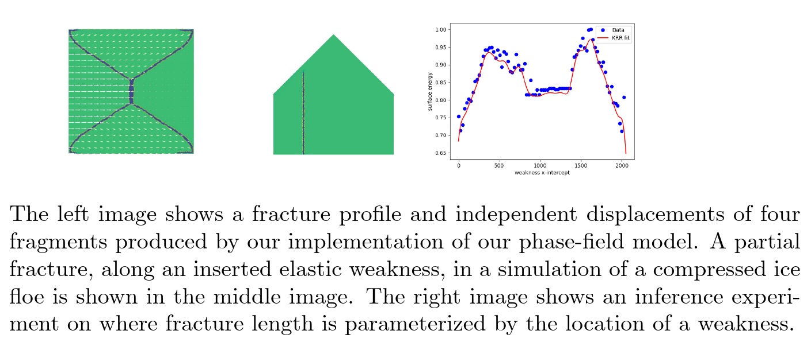

## Observational analyses of sea ice and ocean dynamics

The Observational Data Analysis group is analyzing both remote sensing and in-situ data to understand the scales of variability of sea-ice floes and the ocean dynamics in the boundary layer beneath sea ice. Individual sea-ice floes have been characterized in high and moderate-resolution optical satellite imagery through the development of automated floe tracking and segmentation procedures. The evolution of the sea-ice floe field is quantified in Beaufort Sea imagery, and interpreted in conjunction with in-situ measurements from the region, including Ice-Profiling Sonar records. Ocean dynamics as they relate to sea ice are examined using Ice-Tethered Profiler measurements of upper-ocean temperature and salinity. These observational analyses provide parameter constraints and validation of the modeling efforts across the other MURI teams.

## Data assimilation and UQ

The Data assimilation and UQ team is currently focusing on two projects: 1) Data assimilation and 2) Uncertainty quantification (UQ) for coupled atmosphere, ocean and sea ice model. The data assimilation project aims at designing efficient and accurate filters to improve the state estimation of the atmosphere and ocean flow fields using the observed Lagrangian trajectories of the sea ice floes. Estimating model parameters and the associated statistics (e.g., sea ice thickness distribution) also belongs to the data assimilation framework. The goal of the UQ project is to explore the role of the atmosphere and ocean in affecting the sea ice dynamics and the associated prediction skill. It also aims at exploring the uncertainty and model error in various cheap and practically useful stochastic parameterizations.

## Discrete element methods development

Here, we present a new discrete-element ice floe model that will explicitly simulate interactions between individual floes as opposed to developing continuous rheology. Our goal is to develop a versatile sea ice model that could be used in conjunction with floe-scale satellite and in situ observations for short-term sea ice predictions, data assimilation, parameter estimation, uncertainty quantification as well as to explore various atmosphere-ocean-ice processes occurring at floe scales. While the ice floe model consists of several mechanical and thermodynamic components, our focus is to develop a set of floe interaction rules that can lead to realistic sea ice mechanics, including the realistic distributions of fractures, sizes, thicknesses, and shapes. This model includes the implementation of various physical processes affecting evolution of floes in the model including collisions, fractures, creation of new floes and packing algorithm, dilution of floes and an Eulerian variable for keeping track of the unresolved small-scale floe, welding, and ridging.

## Superparametrized sea ice models

Led by the NYU team, we develop a superparameterized sea ice (SPICE)
model that captures dynamics at multiple spatial and temporal
scales. Arctic sea ice contains many ice floes---chunks of ice---whose
macro-scale behavior is driven by oceanic/atmospheric currents and
floe-floe interaction. There is no characteristic floe size; data
suggest the floe size distribution follows a power law. Therefore,
accurately modeling sea ice dynamics requires a multi-scale
approach. Our two-tiered model couples basin-scale conservation
equations with small-scale discrete element particle methods. The
basin-scale sea ice dynamics are primarily driven by external forces
(wind and ocean stresses), which advect ice floes. Small-scale floe
dynamics---deformation, fracture, and collisions---lead to emergent
behavior such as lead formation and ridging. Unlike many other sea ice
models, we do not average quantities of interest (e.g., mass/momentum)
over a representative volume element; we explicitly model small-scale
dynamics. We formulate a mathematical modeling framework that
rigorously couples a macro-scale PDE with small-scale particle
methods.

## Atmosphere-ice-ocean coupling

The Caltech group is working to improve our understanding of how
oceanic and atmospheric circulations influence the characteristics of
a heterogeneous sea ice field.  The group is working closely with
other team members to build a hierarchy of numerical models to
represent coupled processes at the ice-ocean-atmosphere interface.  Of
particular interest is the impact of ice floes on modifying mechanical
and buoyancy forcing, or surface stress and heat/freshwater fluxes, in
the marginal ice zone; the formation and evolution of small-scale
fronts in the ocean surface boundary layer and its contribution sea
ice melt; the role of oceanic and atmospheric flows on sea-ice
transport.  Our models span idealized ocean turbulence simulations to
high resolution GCMs and LES simulations.  We will also use a
combination of remote sensing and in situ observations to guide model
development and to validate key dynamical processes (see Yale group
for further details).

## Machine Learning on Phase-Field Models of Sea Ice Fracture

Our NYU team is developing a machine learning framework that is capable of inferring fracture behaviors from physical inputs. The fracture of individual floes impacts lead formation and floe size distribution which in turn affect basin-scale sea ice transport. Fracture patterns sharply depend on internal structures (such as frozen cracks and ridges), external forces from the surrounding ocean and atmosphere, and floe geometry. This work has two goals: We aim to develop a mathematical model of fracture that simulates floe-scale physics and machine learning methods to infer fracture behaviors from physical parameters. We are developing phase-field models of fracturing ice floes that efficiently simulates fracture profiles in response to insertions of elastic heterogeneities, geometries and external forces. Ultimately, our framework could be used to infer fracture behaviors such as the number of fragments and fracture orientation from satellite images of ice floes.

