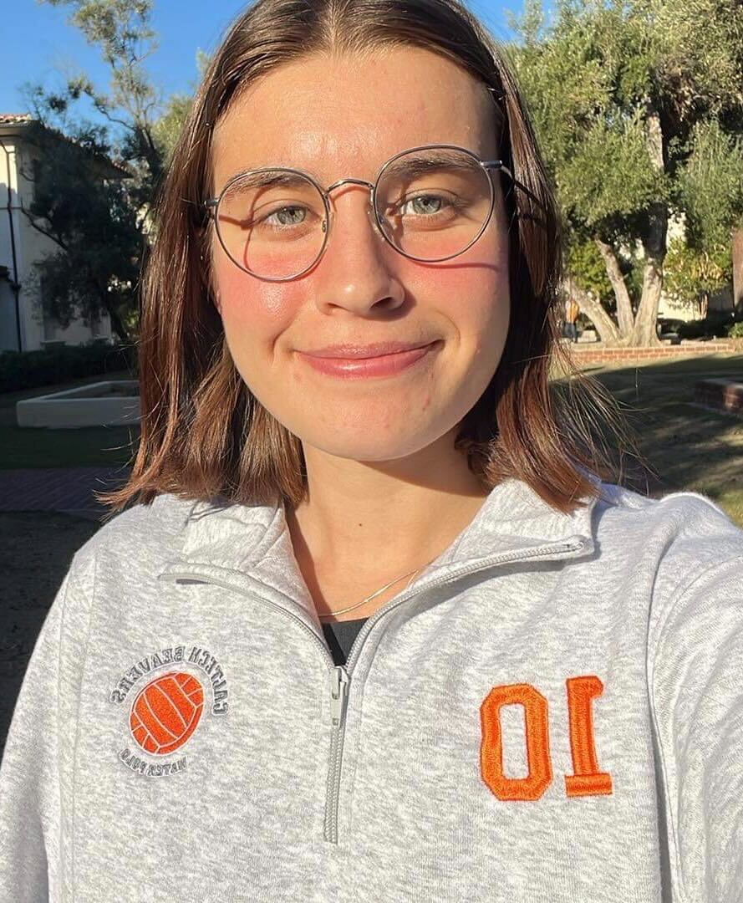
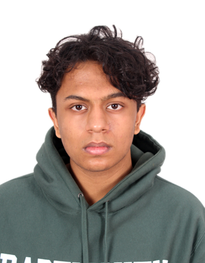
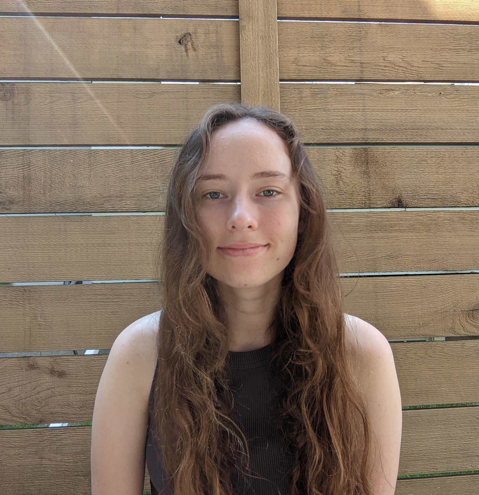
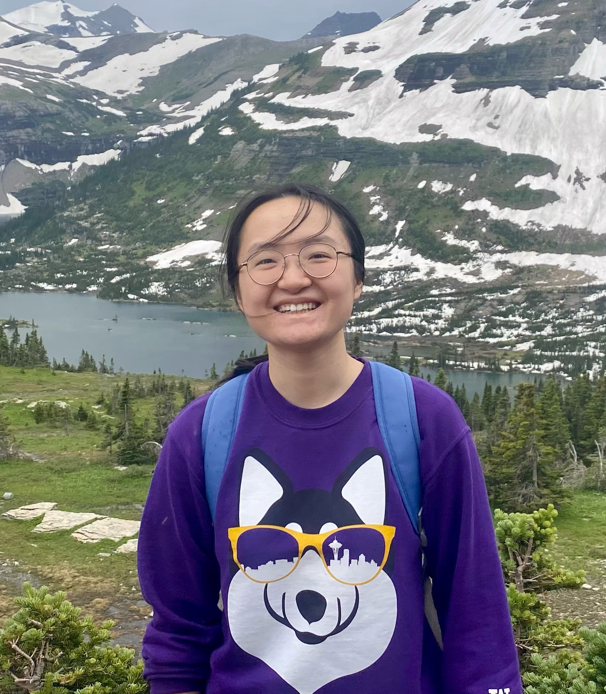
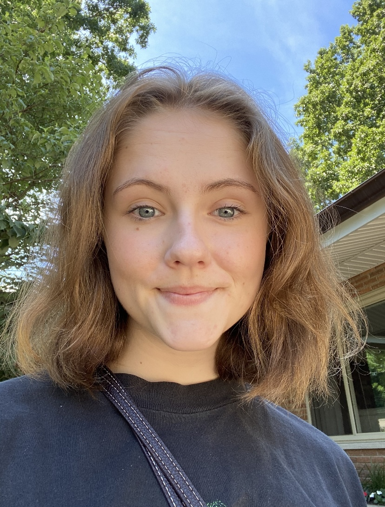
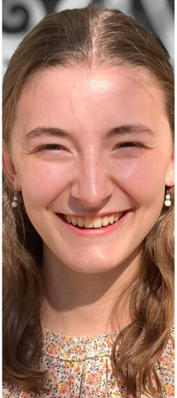

Each university within this MURI is dedicated to involving undergraduates in research. Below is list of current undergraduate researchers within labs and a brief description of their projects. 

## Brown University
<table class="fixed">
  <col width="200"/>
  <col width="200"/>
  <col width="200"/>
  <tr>
    <td> <!-- Simon Hatcher -->
        

            
          

            <h4><a href="" target="_blank">Simon Hatcher</a></h4>
          

        

    </td>
    <td> <!-- Benjamin Newcomb -->
        

            
          

            <h4><a href="" target="_blank">Benjamin Newcomb</a></h4>
          

        

    </td>
  </tr>
</table>

- Simon has developed useful tools for satellite tracking and MODIS data query and download, and assisted with data analysis.
- Benjamin has been analyzing surface drifter data for characterizing mesoscale eddies in the Arctic Ocean.

## California Institute of Technology
<table class="fixed">
  <col width="200"/>
  <col width="200"/>
  <col width="200"/>
  <tr>
    <td> <!-- Emma Gurcan -->
        

          
        

            <h4><a href="" target="_blank">Emma Gurcan</a></h4>
        

        

    </td>
  </tr>
</table>

- Emma's work within Andy Thompson's group relates to the dispersion of sea ice floes due to oceanic eddies. She uses a model of sea ice floes coupled to an ocean model to explore how floe size influences the width of the marginal ice zone and its energetics
    

<!-- ## Courant Institute NYU
<table class="fixed">
  <col width="200"/>
  <col width="200"/>
  <col width="200"/>
  <tr>
  </tr>
</table> -->

## Dartmouth College
<table class="fixed">
  <col width="200"/>
  <col width="200"/>
  <col width="200"/>
  <tr>
    <td> <!-- Karun Ram -->
        

            
          

            <h4><a href="" target="_blank">Karun Ram</a></h4>
          

        

    </td>
  </tr>
</table>

- Karun is working on Markov modeling of Arctic buoy data.

## University of Washington
<table class="fixed">
  <col width="200"/>
  <col width="200"/>
  <col width="200"/>
  <tr>
    <td> <!-- Robin Chartrand -->
        

            
          

            <h4><a href="https://deep.ocean.washington.edu/" target="_blank">Robin Chartrand</a></h4>
          

        

    </td>
    <td> <!-- Yuna Liu -->
        

            
          

            <h4><a href="https://deep.ocean.washington.edu/" target="_blank">Yuna Liu</a></h4>
          

        

    </td>
    <td> <!-- Camille Viviani -->
        

            
          

            <h4><a href="https://deep.ocean.washington.edu/" target="_blank">Camille Viviani</a></h4>
          

        

    </td>
  </tr>
</table>

- Robin is an undergraduate research assistant working on the development of Python-based GUI for visualization of data and segmentation of oceanographycally-relevant features.

- Yuna is an undergraduate student working on numerical modeling of sea ice as it transitions through Nares Straits.

- Camille is an undergraduate research assistant working on understanding the floe size distribution of sea ice as it passes through narrow straits.

## University of Wisconsin - Madison
<table class="fixed">
  <col width="200"/>
  <col width="200"/>
  <col width="200"/>
  <tr>
    <td> <!-- Evelyn Tollar -->
        

            
          

            <h4><a href="" target="_blank">Evelyn Tollar</a></h4>
          

        

    </td>
    <td> <!-- Marissa Zhang -->
        

            
          

            <h4><a href="" target="_blank">Marissa Zhang</a></h4>
          

        

    </td>
  </tr>
</table>

- Evelyn and Marissa are working on computational algorithms for discrete models of sea ice floes.

## Yale University
<table class="fixed">
  <col width="200"/>
  <col width="200"/>
  <col width="200"/>
  <tr>
    <td> <!-- Megan Grimes -->
        

            
          

            <h4><a href="https://people.earth.yale.edu/profile/mary-louise-timmermans/about" target="_blank">Megan Grimes</a></h4>
          

        
 
    </td>
    <td> <!-- Madelyn Stewart -->
        

            
          

            <h4><a href="https://people.earth.yale.edu/profile/mary-louise-timmermans/about" target="_blank">Madelyn Stewart</a></h4>
          

        

    </td>
  </tr>
</table>

- Megan is an undergraduate student working on examination of sea-ice floe shapes in high-resolution satellite images.

- Madelyn is an undergraduate student studying seasonal and spatial variation of inertial oscillations in drifting sea ice on a pan-Arctic scale.

## Former Undergraduate Researchers
<table class="fixed">
  <col width="200"/>
  <col width="200"/>
  <col width="200"/>
  <tr>
    <td> <!-- Leela Canuelas-Puri -->
        

            
          

            <h4><a href="" target="_blank">Leela Canuelas-Puri</a></h4>
            

              
(Brown University)

            

          

        

    </td>
    <td> <!-- Kangqi Fu -->
        

            
          

            <h4><a href="" target="_blank">Kangqi Fu</a></h4>
            

              
(University of Wisconsin-Madison)

            

          

        

    </td>
    <td> <!-- Linkai Ma -->
        

            
          

            <h4><a href="" target="_blank">Linkai Ma</a></h4>
            

              
(Courant Institute, NYU)

            

          

        

    </td>
    <td> <!-- Sean Mackin -->
        

            
          

            <h4><a href="" target="_blank">Sean Mackin</a></h4>
            

              
(Courant Institute, NYU)

            

          

        

    </td>
  </tr>
  <tr>
    <td> <!-- Amy Rhee -->
        

            
          

            <h4><a href="" target="_blank">Amy Rhee</a></h4>
            

              
(Courant Institute, NYU)

            

          

        

    </td>
  </tr>
</table>